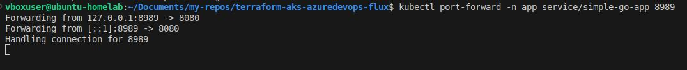
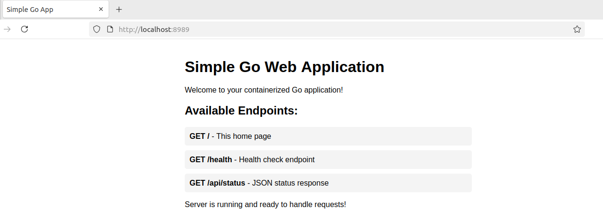

##Run the simple Go Container application

### Build and Run locally
```
docker build -t simple-go-app .
```
```
docker run -d -p 8080:8080 simple-go-app:1.0.0
```

### Test the Local application

```
curl http://localhost:8080
```

## Push to GitHub Packages

```
docker tag simple-go-app ghcr.io/<vijai-veerapandian>/simple-go-app:1.0.0

```

### Push the docker image into the github package image repository

Log in to the GitHub Container Registry using your Personal Access Token (PAT).

```
export CR_PAT=COPIED_PAT
echo $CR_PAT | docker login ghcr.io -u <github-username> --password-stdin

docker push ghcr.io/<github-username>/simple-go-app:1.0.0
```

### Now, Use local Kind cluster to generate Kubernetes manifests file to enable this application to run on top of kubernetes cluster through deployment.

```
kind create cluster context local-man
kind create cluster-info
```

### Once Kind is up as per above command. Now, use kubectl cmds to generate application deployment yaml file and loadbalancer yaml file.

```
kubectl create deployment simple-go-app --image=ghcr.io/<github-username>/simple-go-app:1.0.0 --port=8080 -n app -o yaml > app.yaml
```

### Make sure Resource limit are set on the container to consume on the deployment yaml file using this as an example up-part from other cleanup.

```
terminationMessagePolicy: File
resources:
3  requests:
    cpu: "100m"
    memory: "64Mi"
  limits:
    cpu: "250m"
    memory: "128Mi"
```

### Expose the application via loadbalancer to access it.

```
kubectl expose deployment simple-go-app --port=8989 --target-port=8080 --dry-run=client -o yaml > app-svc.yaml
```

### Create separate namespace for the application

```
kubectl ns app -o yaml > namespace.yaml
```

### Create secret file with ghcr.io credentials.so, Kubernetes can pull the image during deployment

```
kubectl create secret docker-registry ghcr-creds --docker-server=ghcr.io --docker-username=vijai-veerapandian --docker-password=$CR_PAT --namespace=app --dry-run=client -o yaml > secret.yaml
```

### Now, Test the application on the local kind k8s cluster

```
kubectl apply -f namespace.yaml
kubectl apply -f secret.yaml
kubectl apply -f app.yaml
kubectl apply -f app-svc.yaml
```
< add screenshot>>

### Now, delete the deployment

```
kubectl delete -f .

```

### For quick testing

```
kubectl port-forward -n app service/simple-go-app 8989:8989
```


### Browser



updated


### Terraform to deploy Azure VM to support Azuredevops self-host pool agent.

```
terraform init
```
```
terraform validate
terraform plan -out=agent-vm.tfplan
terraform apply agent-vm.tfplan
```
